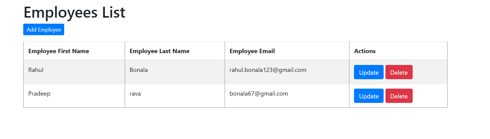
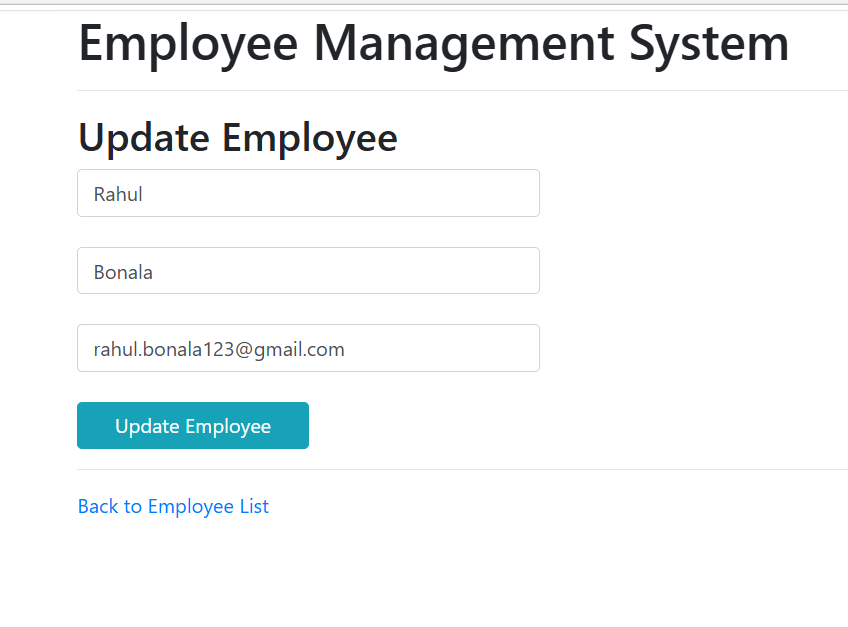

# Project Title:

Employee Management (CRUD) System

## 1. Project Description:

A Spring MVC web application for Employee Information Management with the following CRUD operations:

- Get all the employees
- Add a new employee
- Update an employee
- Delete an employee


## 2. Tech Stack:

- Java 17
- Spring Boot
- HTML
- Bootstrap
- Thymeleaf
- Spring MVC
- Spring Data JPA
- Hibernate
- Maven 
- H2 In-Memory Database


## 3. Installing:

i. Clone the git repo

```
https://github.com/rahu2004/Java_springboot.git
```
## 4. How To Use:

i. Open project in preferred IDE or terminal 

ii. Run the project using Maven:
`mvn spring-boot:run`

iii. Hibernate will automatically create the `employee` table.

iv. Open the web app at: http://localhost:8080/

v. (Optional) Access the H2 Database Console at http://localhost:8080/h2-console (JDBC URL: `jdbc:h2:mem:testdb`, User: `sa`, Password: `[blank]`)

vi. Add, Update and Delete records from the web app 

Have fun
😎 


## 5. Demo:

### - All Employee UI



### - Add Employee UI


### - Update UI


